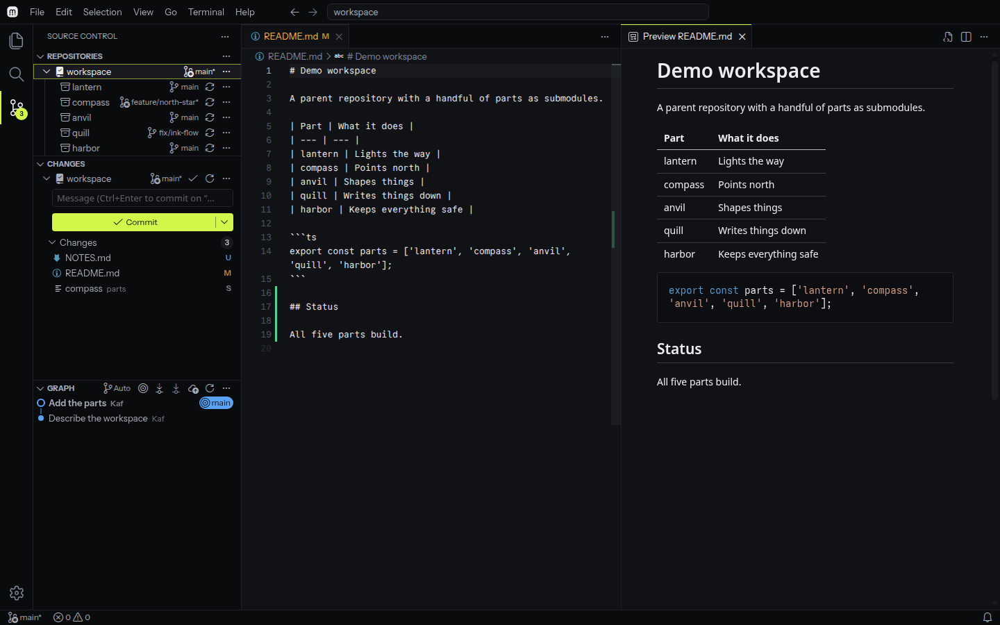

<h1 align="center"><br>Minv</h1>

<p align="center">VS Code, cut down to what you open it for.<br><a href="https://minv.tyranny.me"><b>minv.tyranny.me</b></a></p>

<p align="center">
  <a href="https://github.com/tyrannyme/minv/actions/workflows/ci.yml"><picture><source media="(prefers-color-scheme: dark)" srcset="https://shieldcn.dev/github/tyrannyme/minv/ci.svg?variant=outline&amp;size=sm&amp;font=geist&amp;mode=dark"></picture></a>
  <a href="https://github.com/tyrannyme/minv/releases"><picture><source media="(prefers-color-scheme: dark)" srcset="https://shieldcn.dev/github/tyrannyme/minv/release.svg?variant=outline&amp;size=sm&amp;font=geist&amp;mode=dark"></picture></a>
  <a href="fork/upstream.json"><picture><source media="(prefers-color-scheme: dark)" srcset="https://shieldcn.dev/badge/Code--OSS-1.137.0.svg?variant=outline&amp;size=sm&amp;font=geist&amp;mode=dark"></picture></a>
  <a href="LICENSE"><picture><source media="(prefers-color-scheme: dark)" srcset="https://shieldcn.dev/badge/license-MIT.svg?variant=outline&amp;size=sm&amp;font=geist&amp;mode=dark"></picture></a>
</p>

<p align="center"></p>

When your agents do the work, you still open an editor now and then: to read a file, look at the changes, commit, check which branch a submodule is on, or read and edit a README. Minv is VS Code with everything else taken out, so it opens fast and stays quiet.

**What's in it:** the Explorer, Quick Open, search, the editor, the integrated terminal, and Source Control with VS Code's own Git (staging, commits, branches, push and pull, the graph). It also renders Markdown previews. Every submodule's branch shows in the Repositories list, and Minv opens up to 256 submodules where VS Code stops at 10.

**What's taken out:** debugging, testing, AI chat, agents and the Agents window, inline completions, the integrated browser, accounts and settings sync, remote development, the extension marketplace, notebooks, language servers, welcome pages and surveys. There's no telemetry.

## Install

Download a package from the [latest release](https://github.com/tyrannyme/minv/releases/latest) and install it:

| Distribution | Package | Install |
| --- | --- | --- |
| Debian, Ubuntu | [`minv-linux-x64.deb`](https://github.com/tyrannyme/minv/releases/latest/download/minv-linux-x64.deb) | `sudo apt install ./minv-linux-x64.deb` |
| Fedora, RHEL, openSUSE | [`minv-linux-x64.rpm`](https://github.com/tyrannyme/minv/releases/latest/download/minv-linux-x64.rpm) | `sudo dnf install ./minv-linux-x64.rpm` |
| Any distribution | [`minv-linux-x64.AppImage`](https://github.com/tyrannyme/minv/releases/latest/download/minv-linux-x64.AppImage) | `chmod +x minv-linux-x64.AppImage` |
| Any distribution | [`minv-linux-x64.tar.gz`](https://github.com/tyrannyme/minv/releases/latest/download/minv-linux-x64.tar.gz) | `tar xzf minv-linux-x64.tar.gz` |
| Windows 10 and 11 | [`minv-win32-x64-setup.exe`](https://github.com/tyrannyme/minv/releases/latest/download/minv-win32-x64-setup.exe) | Run it. It installs for your user, no admin needed |
| Windows, portable | [`minv-win32-x64.zip`](https://github.com/tyrannyme/minv/releases/latest/download/minv-win32-x64.zip) | Extract it and run `Minv.exe` |

The .deb, the .rpm and the Windows installer add Minv to your app launcher or Start menu and a `minv` command to your terminal, so `minv .` opens the current folder (on Windows, open a new terminal after installing). The AppImage, the archive and the zip don't add a command; link one yourself:

```sh
ln -s ~/Applications/minv-linux-x64.AppImage ~/.local/bin/minv   # AppImage
ln -s "$PWD/minv-linux-x64/bin/minv" ~/.local/bin/minv          # archive
minv /path/to/workspace
```

Check a download with `sha256sum -c --ignore-missing SHA256SUMS` from the same release.

Linux and Windows on x64, and you need Git installed. Minv keeps its settings in `~/.config/Minv` and `~/.minv` (`%APPDATA%\Minv` and `%USERPROFILE%\.minv` on Windows), separate from VS Code's. Builds are unsigned, so Windows SmartScreen asks before the first run, and they don't update themselves: install a newer package to update.

## Build

You need Node.js 24.18.0, Git, a C/C++ toolchain, and the X11 keyboard, libsecret and Kerberos development headers (`libxkbfile-devel libsecret-devel krb5-devel` on Fedora, `libxkbfile-dev libsecret-1-dev libkrb5-dev` on Debian and Ubuntu).

```sh
npm run setup      # fetch the pinned Code-OSS source, apply Minv's changes, install its dependencies
npm run compile    # development build
npm start -- /path/to/workspace
npm run build      # minified app in .upstream/VSCode-linux-x64
npm run package    # build/release: minv-linux-x64.tar.gz, .deb and .rpm
```

`npm run capture -- <workspace> out.png --app=.upstream/VSCode-linux-x64/minv` opens the app in a private Xvfb display and screenshots it, so nothing appears on your desktop. It can also click rows, press keys and type (`--click`, `--keys`, `--type`).

The landing page lives in [`site/`](site). Deploy it with `cd site && wrangler deploy`.

## How the fork works

Minv's changes to Code-OSS live in [`fork/`](fork). [`scripts/fork-prepare.mjs`](scripts/fork-prepare.mjs) applies them to a pristine checkout of the pinned upstream commit every time, so the fork never drifts:

| File | What it changes |
| --- | --- |
| [`fork/upstream.json`](fork/upstream.json) | The exact Code-OSS commit Minv is built from |
| [`fork/strip.json`](fork/strip.json) | Workbench features that aren't registered |
| [`fork/extensions-remove.json`](fork/extensions-remove.json) | Built-in extensions that aren't shipped |
| [`fork/product.json`](fork/product.json) | Name, data folders, and default settings |
| [`fork/extensions/minv-theme`](fork/extensions/minv-theme) | Minv Dark and Minv Light |
| [`fork/overlay`](fork/overlay) | Icons, the bundled Instrument Sans and Commit Mono fonts, and the .deb and .rpm package templates |
| [`fork/patches`](fork/patches) | Small source and build patches, each one commented |

VS Code's chat and MCP services stay registered, though nothing uses them, because Tasks and the terminal depend on them. `chat.disableAIFeatures` is on, and every AI view, extension and the Agents window are removed.

Pushing a tag `v<version>` that matches `package.json` builds, smoke-tests and publishes a release. CI compiles native modules against upstream's glibc 2.28 sysroot, so the Linux packages run wherever VS Code does. Before publishing, it installs the .deb on Ubuntu, the .rpm on Fedora, and the Windows installer on Windows, and opens the app from the archive, the .deb, the AppImage and the Windows install. `npm run package -- tar rpm` builds only some formats; the .deb needs `dpkg-deb`, the .rpm `rpmbuild`, and the AppImage `appimagetool` (or `APPIMAGETOOL=/path/to/it`). On Windows, build with `npm run gulp vscode-win32-x64-min` in `.upstream/build`, then `npm run package` makes the installer and zip.

## License

[MIT](LICENSE). Minv is built from Microsoft's MIT-licensed [Code-OSS](https://github.com/microsoft/vscode) source, not from the Visual Studio Code product, and doesn't use the Visual Studio Marketplace. The bundled fonts are under the SIL Open Font License.
