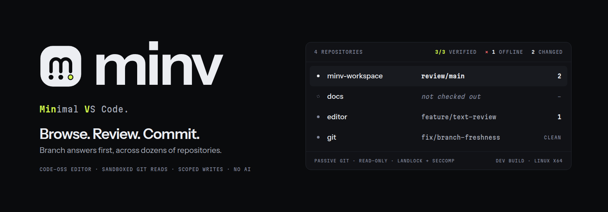
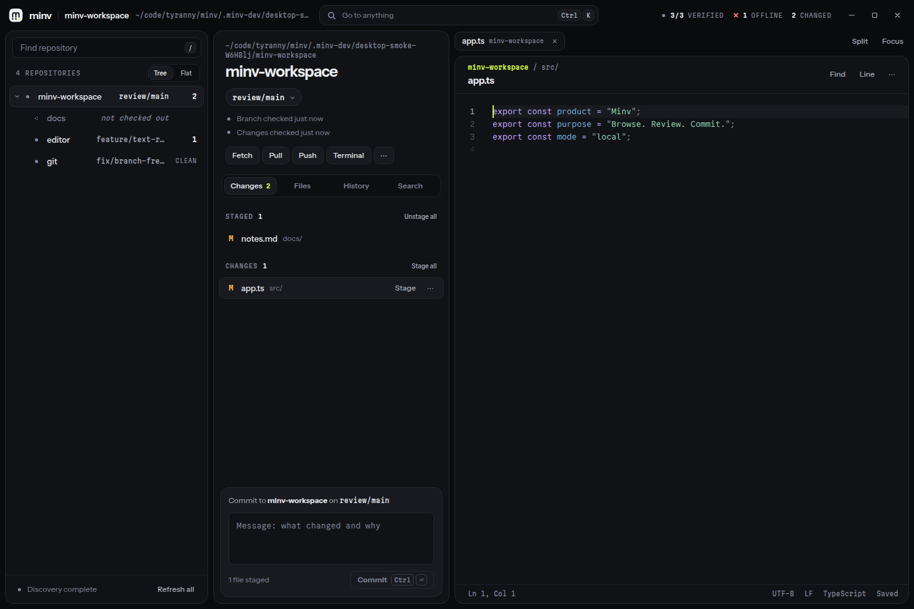

<p align="center">
  
</p>

<p align="center">
  <a href="#status"><picture><source media="(prefers-color-scheme: dark)" srcset="https://shieldcn.dev/badge/status-development_build-D2F74A.svg?variant=outline&amp;size=sm&amp;font=geist&amp;mode=dark"></picture></a>
  <a href="docs/PACKAGING.md"><picture><source media="(prefers-color-scheme: dark)" srcset="https://shieldcn.dev/badge/Linux-x64.svg?variant=outline&amp;size=sm&amp;font=geist&amp;logo=linux&amp;mode=dark"></picture></a>
  <a href="docs/EDITOR_BUILD.md"><picture><source media="(prefers-color-scheme: dark)" srcset="https://shieldcn.dev/badge/Code--OSS-1.137.0.svg?variant=outline&amp;size=sm&amp;font=geist&amp;mode=dark"></picture></a>
  <a href="docs/DESKTOP_ENGINEERING.md"><picture><source media="(prefers-color-scheme: dark)" srcset="https://shieldcn.dev/badge/Electron-44.5.1.svg?variant=outline&amp;size=sm&amp;font=geist&amp;logo=electron&amp;mode=dark"></picture></a>
  <a href="docs/GIT_RUNTIME.md"><picture><source media="(prefers-color-scheme: dark)" srcset="https://shieldcn.dev/badge/Git-2.48%2B.svg?variant=outline&amp;size=sm&amp;font=geist&amp;logo=git&amp;mode=dark"></picture></a>
  <a href="LICENSE"><picture><source media="(prefers-color-scheme: dark)" srcset="https://shieldcn.dev/badge/license-MIT.svg?variant=outline&amp;size=sm&amp;font=geist&amp;mode=dark"></picture></a>
</p>

<p align="center"><b>Min</b>imal <b>V</b>S Code: a desktop code browser and Git client for workspaces with dozens of repositories.</p>

> A small question about your code must never wait for the entire workspace.

Open a workspace with forty submodules and ask which branch one of them is on. Minv answers from a stable repository list. It doesn't wait for every working-tree status, and rows don't move while information arrives.

Minv is a standalone desktop app. It runs a text editor built from Code-OSS source inside its own Electron shell. There's no stock workbench, no extension host, and no AI. Use your agents, terminals, and IDEs next to it.

<p align="center">
  
</p>

<p align="center"><sub>Not a mockup. This is the Linux x64 development build, captured by <a href="scripts/desktop-smoke.mjs"><code>scripts/desktop-smoke.mjs</code></a> against a throwaway workspace with submodules.</sub></p>

## Why it's different

**Branches first.** Each repository row gets its branch from its own metadata read, with a reserved process slot. A slow status scan in one checkout never blocks the branch answer in another. Rows keep their place while discovery streams in, and missing or broken checkouts fail on their own row.

**Reads are confined by the kernel.** Passive Git runs inside a small native launcher that uses Landlock and seccomp. Git can read your repository. It can't write files, open sockets, or run another program. That means no hooks, filters, credential helpers, or pagers. If a read needs a repository-defined filter, Minv reports that it can't answer instead of guessing.

**Writes are explicit and scoped.** The Git service stages hunks, commits, branches, stashes, fetches, pulls (fast-forward only), and pushes, one repository at a time. Every write carries a token tied to the exact diff or status you were looking at. If HEAD, the index, or the file changed since then, the write is refused and Minv shows you what moved. Trusted writes use your real Git, so your hooks, signing, and filters still apply. There's no force push, hard reset, `clean`, or automatic stage-all.

**Your work survives.** Saves compare against the version you opened and never overwrite another tool's edit. Unsaved buffers are kept as recovery drafts. Discard and delete make a backup first, and you can restore from it.

**Local by default.** Passive Git can't open sockets or lazily fetch objects, so opening and inspecting a workspace doesn't start network traffic. Fetch, pull, and push only run when you ask. Search uses a bundled, pinned ripgrep. There's no telemetry, auto-update, or remote asset.

**Deliberately left out:** AI chat and completions, MCP and agent sessions, debugging, tasks, notebooks, the integrated terminal, the extension marketplace, accounts and sync, and GitHub-specific integrations. They're removed from the build, not hidden behind settings. Plain Git remotes still work with your existing credentials.

## Status

> [!IMPORTANT]
> **Minv is a development build. It has no release yet.** The desktop app boots on Linux x64 with the source-built editor, the custom shell, and live Git. Release validation is still in progress, and every PRD requirement and release gate is still open. [docs/COMPLETION.md](docs/COMPLETION.md) tracks each one with its evidence.

| Piece | Where it stands |
| --- | --- |
| Code-OSS editor | Built from upstream `1.137.0` source with a reviewed, audited input closure. Its sandboxed Electron smoke test passes. |
| Desktop shell | Boots against a live multi-repository Git workspace. Runs sandboxed, with context isolation and a local-only protocol. The latest packaged-app smoke run ([`scripts/desktop-smoke.mjs`](scripts/desktop-smoke.mjs)) passes. |
| Passive Git sandbox | Landlock and seccomp confinement, with adversarial tests on Linux. |
| Packaging | The Linux x64 packaging script and audit exist. The archive isn't signed, and there's no updater. |
| Performance budgets | End-to-end budgets such as launch-to-painted-branch **have not been measured** yet. |

Only Linux x64 is targeted. Windows and macOS aren't built.

## Build and run

You need Linux x64 with kernel 6.12 or newer (Landlock ABI 6) and seccomp user notifications, Git 2.48 or newer, a C compiler with Linux headers, and Node.js 22 or newer with npm. The pinned Code-OSS source expects Node.js 24.18.0 for the editor build.

```sh
npm ci
npm run upstream:fetch                 # fetch the pinned Code-OSS source into .upstream/
npm run desktop:build                  # sandbox helper, editor (if its audit fails), renderer, and app
npm start -- /path/to/workspace        # launch the built app with the local Electron
```

`npm start` runs [`scripts/minv.mjs`](scripts/minv.mjs), the same CLI as the packaged `bin/minv`:

```sh
npm start -- --repo /path/to/repository
npm start -- --goto src/example.ts:42:5
npm start -- --diff before.txt after.txt
npm start -- --help
```

### Check it

```sh
npm test                                # core Git, catalog, file, and sandbox tests in temporary repositories
npm run check                           # type-check the extension, desktop, and renderer
npm run editor:audit                    # verify the editor build against its reviewed source closure
npm run editor:test                     # sandboxed Electron smoke test of the editor
node scripts/desktop-smoke.mjs          # boot the real app against a disposable workspace and take a screenshot
```

The desktop smoke test writes `build/desktop/smoke.json` and `smoke.png`. It uses `xvfb-run` when it's installed.

### Package

```sh
npm run desktop:package                 # build/release/minv-<version>-linux-x64 plus a .tar.gz
node scripts/package-desktop.mjs --audit build/release/minv-0.1.0-linux-x64
```

The package bundles Electron, the sandbox helper, and ripgrep. It doesn't need a system Node.js. Git isn't bundled. See [docs/PACKAGING.md](docs/PACKAGING.md) for per-user install and checksums.

No step downloads and runs a remote package. Everything uses the tools `npm ci` installed.

## Docs

| Document | What it covers |
| --- | --- |
| [MINV_PRD.md](MINV_PRD.md) | Product requirements, rules, budgets, and release gates |
| [docs/COMPLETION.md](docs/COMPLETION.md) | Each requirement's status and evidence |
| [docs/DESKTOP_ENGINEERING.md](docs/DESKTOP_ENGINEERING.md) | Process boundaries and ownership |
| [docs/EDITOR_BUILD.md](docs/EDITOR_BUILD.md) | The source-built editor, provenance, and exclusions |
| [docs/GIT_RUNTIME.md](docs/GIT_RUNTIME.md) | The passive Git sandbox and scheduling |
| [docs/PACKAGING.md](docs/PACKAGING.md) | Linux packaging, the CLI, and installation |
| [docs/DEVELOPMENT.md](docs/DEVELOPMENT.md) | The earlier extension prototype, kept as a development harness |

## License

[MIT](LICENSE). The bundled Code-OSS editor keeps Microsoft's upstream MIT license and notices, and other third-party notices ship with the package. Minv isn't built from Microsoft's branded VS Code binaries and doesn't use the Visual Studio Marketplace.
